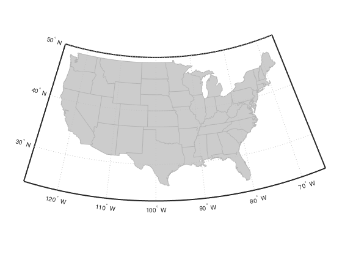
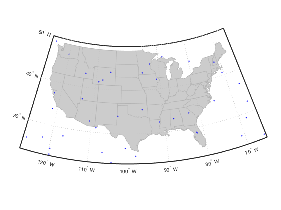
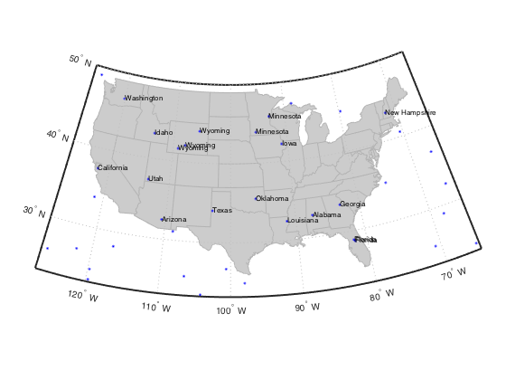

## interpshapefile.m Documentation

This program determines the attribute value at the given points, based on
the corresponding attribute data in a shapefile.

### Syntax

```
value = interpshapefile(S, lat, lon, attribute)
```
See function help for full description of input and output variables

### Example

We'll use the usastatlo.shp shapefile for our example.

```matlab
States = shaperead('usastatelo', 'UseGeoCoords', true);

usamap('conus');
geoshow('usastatelo.shp', 'facecolor', ones(1,3)*0.8, ...
        'edgecolor', ones(1,3)*0.7);
```



Scatter some random points.

```matlab
latlim = getm(gca, 'maplatlimit');
lonlim = getm(gca, 'maplonlimit');

lon = rand(40,1) * diff(lonlim) + lonlim(1);
lat = rand(40,1) * diff(latlim) + latlim(1);

plotm(lat, lon, 'b.');
```



Determine which state each point is in.

```matlab
sname = interpshapefile(States, lat, lon, 'Name');
textm(lat, lon, sname, 'fontsize', 8);
```



