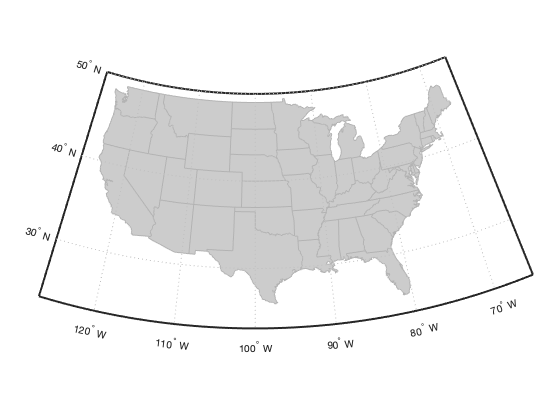

# interpshapefile.m documentation


Author: Kelly Kearney


This repository includes the code for the `example.m` Matlab function, along with all dependent functions required to run it.


Paragraph description for this function or suite of functions.


## Contents

            
- Getting started        
- Syntax        
- Description        
- Examples        
- Contributions

## Getting started


**Prerequisites**


This function requires Matlab R14 or later.


**Downloading and installation**


This code can be downloaded from [Github](https://github.com/kakearney/interpshapefile-pkg/) or the [MatlabCentral File Exchange](http://www.mathworks.com/matlabcentral/fileexchange/10278-interpshapefile).  The File Exchange entry is updated daily from the GitHub repository.


**Matlab Search Path**


The following folders need to be added to your Matlab Search path (via `addpath`, `pathtool`, etc.):


```matlab
interpshapefile-pkg/interpshapefile
```


## Syntax


```
value = interpshapefile(S, lat, lon, attribute)
```


## Description


`value = interpshapefile(S, lat, lon, attribute)` determines the `value` corresponding to location(s) with latitude `lat` and longitude `lon` based on the `attribute` field associated with polygons in the geographic data structure `S` (as returned by a call to `shaperead`).  At minimum, `S` must include fields of 'Lat', 'Lon', and the specified attribute, and contain one or more elements with 'Polygon' Geometry.  The returned `value` will either be a numeric or cell array, depending on the class of the attribute field; points outside of the polygons will receive a NaN or empty array as applicable.


## Examples


We'll use the usastatlo.shp shapefile for our example; this file is included with the Mapping Toolbox:


```matlab
States = shaperead('usastatelo', 'UseGeoCoords', true);

usamap('conus');
geoshow('usastatelo.shp', 'facecolor', ones(1,3)*0.8, ...
        'edgecolor', ones(1,3)*0.7);
```




Scatter some random points.


```matlab
latlim = getm(gca, 'maplatlimit');
lonlim = getm(gca, 'maplonlimit');

rng(1); % for reproducability only
lon = rand(40,1) * diff(lonlim) + lonlim(1);
lat = rand(40,1) * diff(latlim) + latlim(1);

plotm(lat, lon, 'b.');
```


Determine which state each point is in.


```matlab
sname = interpshapefile(States, lat, lon, 'Name');
textm(lat, lon, sname, 'fontsize', 8);
```


## Contributions


Community contributions to this package are welcome!


To report bugs, please submit [an issue](https://github.com/kakearney/interpshapefile-pkg/issues) on GitHub and include:


  - your operating system
  - your version of Matlab and all relevant toolboxes (type `ver` at the Matlab command line to get this info)
  - code/data to reproduce the error or buggy behavior, and the full text of any error messages received

Please also feel free to submit enhancement requests, or to send pull requests (via GitHub) for bug fixes or new features.


I do monitor the MatlabCentral FileExchange entry for any issues raised in the comments, but would prefer to track issues on GitHub.


<sub>[Published with MATLAB R2019a]("http://www.mathworks.com/products/matlab/")</sub>
